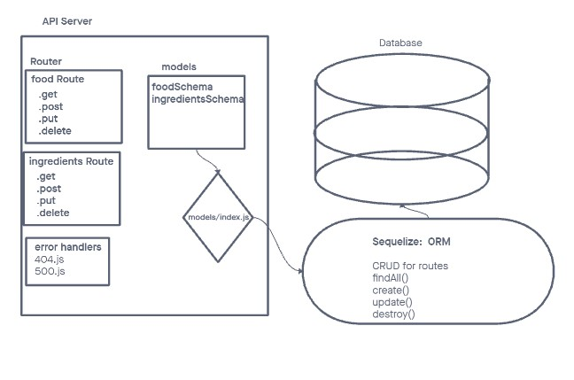

# LAB - Class 03

## api-server

## Author: Kaeden O'Meara

## Problem Domain

Separate routers that contain all of the routing logic and handlers using Express.router(). Sequelize, Postgres, and tests.

## Links and Resources

[GitHub Actions](https://github.com/KaedenOC/api-server/actions)

[back-end prod server](https://api-server-8rne.onrender.com)

## Collaborators

Referenced from in class demo as well as worked with instructor Ryan.

## Setup

.env requirements (where applicable) port variable exists within the env sample.

## How to initialize/run your application (where applicable)

clone repo, npm i, then run nodemon in the terminal.

## Routes

GET : /food, /ingredients. Full CRUD functionality for both endpoints.

## Tests

To run tests, after running npm i, run the command npm test

UML

## Notes from josh

- Code looks good and was easy to read when I hopped in.

- I would just make sure that your test coverage is good.
